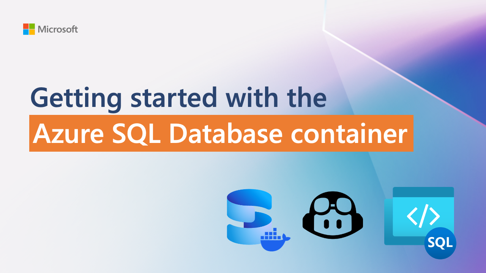

# Azure SQL Database container

Run and build against Azure SQL Database, right on your local environment. Try it before you deploy, run your tests in CI, and ship with no code change. Free for development, with no Azure subscription and no credit card required.

**▶ Watch the demo**

The Azure SQL Database container is the Azure SQL Database engine, running locally. It runs on any modern container runtime (Docker, Podman, containerd, Rancher Desktop, Apple Container) on macOS, Linux, and Windows, and works with the drivers, ORMs, and editors developers already use. It supports the same AI-native capabilities as Azure SQL Database in the Microsoft Azure cloud: the native vector type, DiskANN vector indexes, vector search with `VECTOR_DISTANCE`, and in-database embeddings.

For the first time, developers can build, test, and ship applications against the Azure SQL Database engine without an Azure subscription and without a shared cloud instance. When you deploy to Azure SQL Database in the Microsoft Azure cloud, it is a connection-string change, not a code change.

## Global Table of Contents

- [What is the Azure SQL Database container?](docs/what-is-the-container.md)
- [Goals of the Private Preview](docs/goals-of-the-private-preview.md)
- [Prerequisites](docs/prerequisites.md)
- [Getting Started](docs/getting-started.md)
- [Known limitations](docs/known-limitations.md)
- [Feedback and how to engage](docs/feedback-and-how-to-engage.md)

## Feedback

- File a bug: [GitHub Issues](https://aka.ms/azuresqldb-container-bug)
- Request a feature: [GitHub Issues](https://aka.ms/azuresqldb-container-feature-request)
- Ask a question, share a build, suggest an idea: [GitHub Discussions](../../discussions)
- Connect with the team: [book a session](https://aka.ms/azuresql-container-meet) or email [azuresqldb-container@microsoft.com](mailto:azuresqldb-container@microsoft.com)
- Real-time conversation: the private Teams channel shared with you in the welcome email

See [Feedback and how to engage](docs/feedback-and-how-to-engage.md) for the full guide on which channel fits which question.

## License

This Private Preview is governed by a separate Private Preview license shared with you during sign-up. The samples in this repository are released under the MIT license.

## Trademarks

This project may contain trademarks or logos for projects, products, or services. Authorized use of Microsoft
trademarks or logos is subject to and must follow
[Microsoft's Trademark & Brand Guidelines](https://www.microsoft.com/en-us/legal/intellectualproperty/trademarks/usage/general).
Use of Microsoft trademarks or logos in modified versions of this project must not cause confusion or imply Microsoft sponsorship.
Any use of third-party trademarks or logos are subject to those third-party's policies.